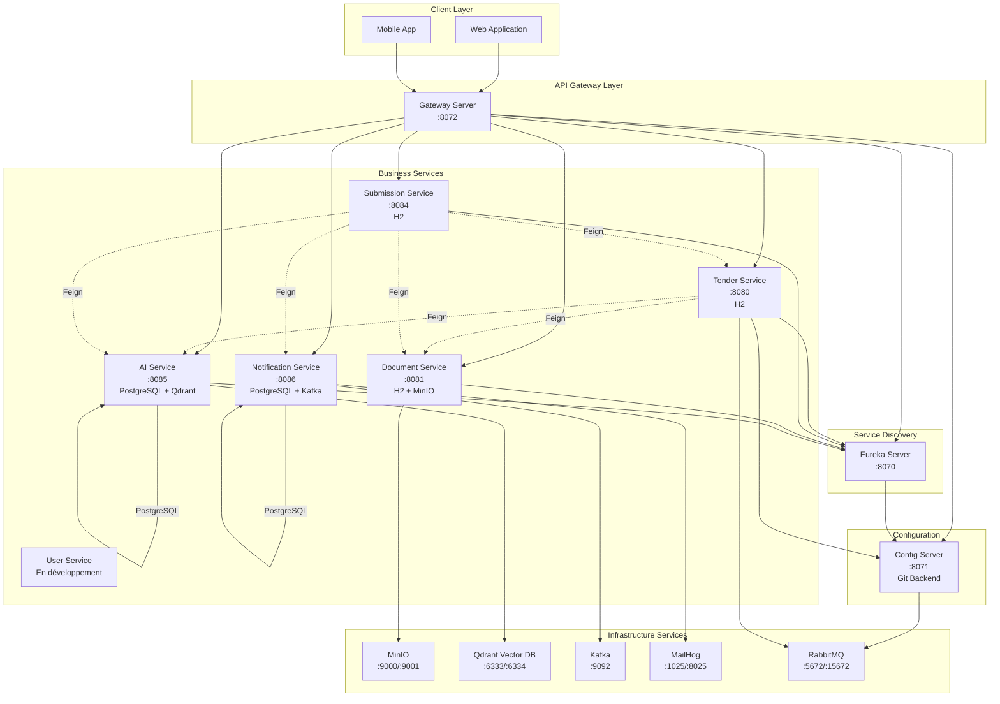
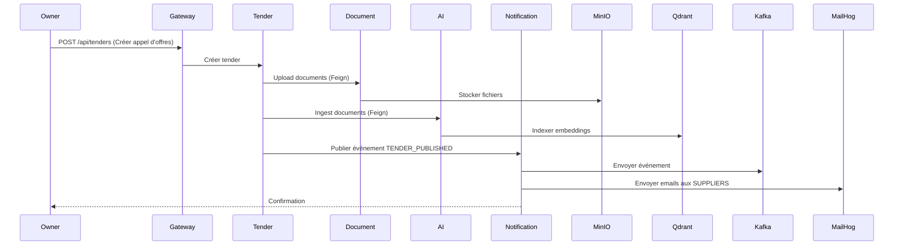
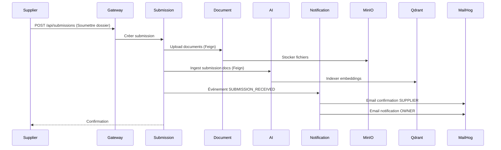
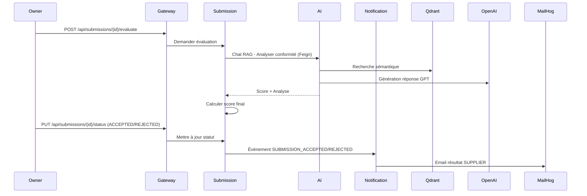
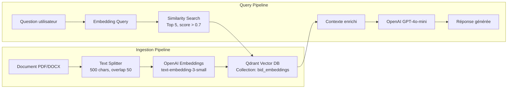

# 🏛️ BidConnect - Plateforme de Gestion des Marchés Publics

[](https://www.oracle.com/java/)
[](https://spring.io/projects/spring-boot)
[](https://spring.io/projects/spring-cloud)
[](LICENSE)

## 📋 Description

**BidConnect** est une plateforme moderne de gestion des marchés publics basée sur une architecture microservices. Elle permet aux administrations publiques (ADMIN, OWNER) de publier des appels d'offres et aux fournisseurs (SUPPLIER) de soumettre leurs dossiers de candidature. La plateforme intègre des fonctionnalités avancées d'intelligence artificielle pour l'analyse automatique des documents et l'évaluation des soumissions.

### 🎯 Objectifs

- **Digitalisation** : Dématérialisation complète du processus d'appel d'offres
- **Transparence** : Traçabilité et équité dans l'évaluation des candidatures
- **Efficacité** : Automatisation de l'analyse documentaire via IA (RAG)
- **Scalabilité** : Architecture microservices distribuée et résiliente

### 👥 Utilisateurs

- **ADMIN** : Administrateur système
- **OWNER** : Gestionnaire d'appels d'offres (Administration publique)
- **SUPPLIER** : Fournisseur / Entreprise soumissionnaire

---

## 🏗️ Architecture Technique

### Vue d'ensemble



### 🔧 Technologies Utilisées

| Catégorie | Technologies |
|-----------|-------------|
| **Langages** | Java 17, Java 21 |
| **Frameworks** | Spring Boot 3.2.x / 3.3.x / 4.0.x, Spring Cloud 2023.0 / 2025.1 |
| **Service Discovery** | Netflix Eureka |
| **API Gateway** | Spring Cloud Gateway (WebFlux) |
| **Configuration** | Spring Cloud Config Server (Git Backend) |
| **Communication** | OpenFeign, REST API |
| **Messaging** | Apache Kafka, RabbitMQ |
| **Bases de données** | PostgreSQL, H2 (in-memory) |
| **Stockage** | MinIO (S3-compatible) |
| **Vector Database** | Qdrant |
| **IA / RAG** | LangChain4j 0.34.0, OpenAI GPT-4o-mini, text-embedding-3-small |
| **Templates Email** | Thymeleaf |
| **Documentation API** | SpringDoc OpenAPI 3 (Swagger) |
| **Mapping** | MapStruct |
| **Containerisation** | Docker, Docker Compose, Jib |
| **Build** | Maven |

---

## 📦 Microservices

| Service | Port | Base de données | Description | Statut |
|---------|------|-----------------|-------------|--------|
| **Config Server** | 8071 | - | Centralisation des configurations (Git) | ✅ Opérationnel |
| **Eureka Server** | 8070 | - | Service Discovery & Registry | ✅ Opérationnel |
| **Gateway Server** | 8072 | - | API Gateway (Routage, Load Balancing) | ✅ Opérationnel |
| **Tender Service** | 8080 | H2 | Gestion des appels d'offres | ✅ Opérationnel |
| **Document Service** | 8081 | H2 + MinIO | Stockage et gestion des documents | ✅ Opérationnel |
| **Submission Service** | 8084 | H2 | Gestion des soumissions fournisseurs | ✅ Opérationnel |
| **AI Service** | 8085 | PostgreSQL + Qdrant | RAG, Chatbot, Analyse documentaire IA | ✅ Opérationnel |
| **Notification Service** | 8086 | PostgreSQL + Kafka | Notifications événementielles (Email) | ✅ Opéationnel |
| **User Service** | - | - | Authentification JWT, Gestion utilisateurs | 🚧 En développement |

### 🔌 Infrastructure Externe

| Service | Ports | Description |
|---------|-------|-------------|
| **MinIO** | 9000 (API), 9001 (Console) | Stockage objet S3-compatible |
| **Qdrant** | 6333 (HTTP), 6334 (gRPC) | Base de données vectorielle |
| **Kafka** | 9092 | Message broker événementiel |
| **Kafka UI** | 8090 | Interface web Kafka |
| **PostgreSQL (AI)** | 5433 | Base de données AI Service |
| **PostgreSQL (Notification)** | 5432 | Base de données Notification Service |
| **MailHog** | 1025 (SMTP), 8025 (Web UI) | Serveur email de test |
| **RabbitMQ** | 5672 (AMQP), 15672 (Management) | Message broker pour Config refresh |
| **pgAdmin** | 5050 | Interface web PostgreSQL |

---

## 🚀 Installation et Démarrage

### Prérequis

- **Java Development Kit (JDK)** : Version 17 ou 21
- **Maven** : Version 3.8+
- **Docker** : Version 20.10+
- **Docker Compose** : Version 2.0+
- **Git** : Pour cloner le repository
- **Clé API OpenAI** : Pour le service IA (optionnel pour les autres services)

### 📥 Cloner le projet

```bash
git clone https://github.com/votre-organisation/bidconnect.git
cd bidconnect
```

### 🐳 Démarrage avec Docker Compose (Recommandé)

#### Option 1 : Infrastructure complète

```bash
cd docker-compose/default
docker-compose up -d
```

Cette commande démarre :
- Config Server
- Eureka Server
- Tender Service
- Document Service + MinIO
- AI Service + PostgreSQL + Qdrant
- RabbitMQ

#### Option 2 : Services individuels

**Notification Service** (avec Kafka, PostgreSQL, MailHog) :
```bash
cd NOTIFICATION-SERVICE
docker-compose up -d
```

**AI Service** (avec Qdrant, PostgreSQL) :
```bash
cd AI-SERVICE
docker-compose up -d
```

### 🔨 Build et démarrage manuel

#### 1. Démarrer l'infrastructure

```bash
cd docker-compose/default
docker-compose up -d rabbit minio qdrant ai-db
```

#### 2. Compiler les services

```bash
# Config Server
cd configserver
./mvnw clean package
java -jar target/configserver-0.0.1-SNAPSHOT.jar

# Eureka Server
cd ../eurekaserver
./mvnw clean package
java -jar target/eurekaserver-0.0.1-SNAPSHOT.jar

# Gateway Server
cd ../gatewayserver
./mvnw clean package
java -jar target/gatewayserver-0.0.1-SNAPSHOT.jar

# Tender Service
cd ../TENDER-SERVICE
./mvnw clean package
java -jar target/TENDER-SERVICE-0.0.1-SNAPSHOT.jar

# Document Service
cd ../DOCUMENT-SERVICE
./mvnw clean package
java -jar target/DOCUMENT-SERVICE-0.0.1-SNAPSHOT.jar

# Submission Service
cd ../SOUMISSION-SERVICE
./mvnw clean package
java -jar target/soumission-service-0.0.1-SNAPSHOT.jar

# AI Service (nécessite OPENAI_API_KEY)
cd ../AI-SERVICE
export OPENAI_API_KEY="votre-clé-api"
./mvnw clean package
java -jar target/AI-SERVICE-0.0.1-SNAPSHOT.jar

# Notification Service
cd ../NOTIFICATION-SERVICE
./mvnw clean package
java -jar target/notification-service-0.0.1-SNAPSHOT.jar
```

### ✅ Vérification du démarrage

#### Eureka Dashboard
```
http://localhost:8070
```
Vérifiez que tous les services sont enregistrés.

#### Swagger UI (Documentation API)

- **Tender Service** : http://localhost:8080/docs
- **Document Service** : http://localhost:8081/swagger-ui.html
- **Submission Service** : http://localhost:8084/docs
- **AI Service** : http://localhost:8085/swagger-ui.html
- **Notification Service** : http://localhost:8086/swagger-ui.html

#### Interfaces Web

- **MinIO Console** : http://localhost:9001 (minioadmin / minioadmin)
- **Qdrant Dashboard** : http://localhost:6333/dashboard
- **Kafka UI** : http://localhost:8090
- **MailHog** : http://localhost:8025
- **RabbitMQ Management** : http://localhost:15672 (guest / guest)
- **pgAdmin** : http://localhost:5050 (admin@bidconnect.com / admin)

---

## 🔄 Workflow Fonctionnel

### 1️⃣ Publication d'un Appel d'Offres (OWNER)



**Étapes** :
1. L'OWNER crée un appel d'offres avec critères d'évaluation
2. Upload des documents (cahier des charges, annexes)
3. Stockage dans MinIO via Document Service
4. Ingestion et indexation IA via AI Service (RAG)
5. Publication de l'événement `TENDER_PUBLISHED`
6. Notification automatique aux fournisseurs éligibles

### 2️⃣ Soumission d'un Dossier (SUPPLIER)



**Étapes** :
1. Le SUPPLIER soumet son dossier de candidature
2. Upload des documents requis (devis, certifications, etc.)
3. Stockage et indexation IA
4. Notification automatique au SUPPLIER (confirmation)
5. Notification à l'OWNER (nouvelle soumission)

### 3️⃣ Évaluation et Sélection (OWNER + IA)



**Étapes** :
1. L'OWNER lance l'évaluation automatique (optionnel)
2. L'IA analyse la conformité via RAG (recherche sémantique)
3. Calcul du score basé sur les critères d'évaluation
4. L'OWNER valide et change le statut (ACCEPTED/REJECTED)
5. Notification automatique au SUPPLIER

---

## 🤖 Module IA & RAG (Retrieval Augmented Generation)

### Architecture RAG

Le **AI Service** implémente une architecture RAG complète pour l'analyse intelligente des documents d'appels d'offres et de soumissions.



### Fonctionnalités IA

#### 1. Ingestion de Documents

**Endpoint** : `POST /api/ai/ingest`

```json
{
  "documentId": "tender-123",
  "documentUrl": "http://document-service:8081/api/documents/tender-123/download"
}
```

**Processus** :
- Téléchargement du document depuis Document Service
- Extraction du texte (PDF, DOCX, TXT)
- Découpage en chunks (500 caractères, overlap 50)
- Génération d'embeddings vectoriels (OpenAI)
- Stockage dans Qdrant (recherche sémantique)
- Sauvegarde métadonnées dans PostgreSQL

#### 2. Chatbot RAG Contextuel

**Endpoint** : `POST /api/ai/chat`

```json
{
  "query": "Quelles sont les conditions de participation à cet appel d'offres ?",
  "conversationId": null
}
```

**Réponse** :
```json
{
  "answer": "Les conditions de participation incluent : 1) Être une entreprise enregistrée...",
  "sources": [],
  "conversationId": "uuid-abc-123"
}
```

**Cas d'usage** :
- Assistance aux fournisseurs (compréhension du cahier des charges)
- Analyse de conformité automatique
- Extraction d'informations clés
- Comparaison de soumissions

### Stack IA

| Composant | Technologie | Rôle |
|-----------|-------------|------|
| **Framework RAG** | LangChain4j 0.34.0 | Orchestration pipeline RAG |
| **LLM** | OpenAI GPT-4o-mini | Génération de réponses |
| **Embeddings** | text-embedding-3-small | Vectorisation sémantique |
| **Vector DB** | Qdrant v1.9.0 | Stockage et recherche vectorielle |
| **Document Parsing** | Apache Tika (via LangChain4j) | Extraction texte multi-format |
| **Metadata Store** | PostgreSQL | Historique et traçabilité |

### Configuration IA

```yaml
langchain4j:
  open-ai:
    chat-model:
      api-key: ${OPENAI_API_KEY}
      model-name: gpt-4o-mini
      temperature: 0.7
    embedding-model:
      api-key: ${OPENAI_API_KEY}
      model-name: text-embedding-3-small
  qdrant:
    host: localhost
    port: 6334  # gRPC
    collection-name: bid_embeddings
```

### Limitations et Améliorations Futures

**Limitations actuelles** :
- Pas d'authentification sur les endpoints IA
- Extraction des sources non implémentée
- Pas de cache des embeddings
- Mémoire de conversation non persistante

**Roadmap IA** :
- [ ] Support multi-langues (FR/EN/AR)
- [ ] Fine-tuning sur domaine des marchés publics
- [ ] Analyse comparative automatique des soumissions
- [ ] Détection d'anomalies et fraudes
- [ ] Génération automatique de rapports d'évaluation

---

## 📡 Communication Inter-Services

### OpenFeign Clients

Les services communiquent via **OpenFeign** (REST synchrone) :

**Tender Service** → Document Service, AI Service  
**Submission Service** → Tender Service, Document Service, AI Service, Notification Service

### Kafka Events (Asynchrone)

**Notification Service** consomme les événements Kafka :

| Event Type | Producteur | Consommateur | Action |
|------------|-----------|--------------|--------|
| `TENDER_PUBLISHED` | Tender Service | Notification Service | Email aux SUPPLIERS |
| `SUBMISSION_RECEIVED` | Submission Service | Notification Service | Email confirmation SUPPLIER + notification OWNER |
| `SUBMISSION_ACCEPTED` | Submission Service | Notification Service | Email acceptation SUPPLIER |
| `SUBMISSION_REJECTED` | Submission Service | Notification Service | Email rejet SUPPLIER |

---

## 🔐 Sécurité (À implémenter)

### User Service (En développement)

Le **User Service** gérera :
- Authentification JWT
- Gestion des rôles (ADMIN, OWNER, SUPPLIER)
- Refresh tokens
- Intégration avec Gateway (filtres JWT)

### Recommandations

- [ ] Implémenter Spring Security + JWT
- [ ] Ajouter HTTPS (TLS/SSL)
- [ ] Secrets management (Vault, AWS Secrets Manager)
- [ ] Rate limiting sur Gateway
- [ ] CORS configuration
- [ ] Audit logging

---

## 📊 Monitoring et Observabilité

### Spring Boot Actuator

Tous les services exposent des endpoints Actuator :

```
http://localhost:<PORT>/actuator
```

**Endpoints disponibles** :
- `/actuator/health` : État de santé
- `/actuator/health/readiness` : Readiness probe (Kubernetes)
- `/actuator/health/liveness` : Liveness probe (Kubernetes)
- `/actuator/info` : Informations applicatives
- `/actuator/metrics` : Métriques Micrometer

### Eureka Dashboard

Visualisation de l'état des services :
```
http://localhost:8070
```

### Logs

```bash
# Logs Docker Compose
docker-compose logs -f <service-name>

# Logs d'un service spécifique
docker logs -f <container-name>
```

---

## 🧪 Tests

### Tests unitaires

```bash
cd <SERVICE-NAME>
./mvnw test
```

### Tests d'intégration

```bash
# Démarrer l'infrastructure
docker-compose up -d

# Tester via Swagger UI ou curl
curl -X GET http://localhost:8080/actuator/health
```

### Test du workflow complet

1. **Créer un appel d'offres** : `POST http://localhost:8080/api/tenders`
2. **Vérifier dans Eureka** : http://localhost:8070
3. **Soumettre un dossier** : `POST http://localhost:8084/api/submissions`
4. **Vérifier les emails** : http://localhost:8025 (MailHog)
5. **Tester le chatbot IA** : `POST http://localhost:8085/api/ai/chat`

---

## 📚 Documentation Complémentaire

- [AI Service README](AI-SERVICE/README.md) - Documentation détaillée du module IA
- [Notification Service README](NOTIFICATION-SERVICE/README.md) - Guide du service de notifications
- [Notification Service - Quick Start](NOTIFICATION-SERVICE/QUICKSTART.md)
- [Notification Service - Kafka UI Guide](NOTIFICATION-SERVICE/KAFKA-UI-GUIDE.md)
- [Notification Service - pgAdmin Guide](NOTIFICATION-SERVICE/PGADMIN-GUIDE.md)
- [Notification Service - Real Email Setup](NOTIFICATION-SERVICE/REAL-EMAIL-SETUP.md)
- [Notification Service - Swagger](NOTIFICATION-SERVICE/SWAGGER.md)

---

## 🛠️ Commandes Utiles

### Docker

```bash
# Démarrer tous les services
docker-compose up -d

# Arrêter tous les services
docker-compose down

# Arrêter et supprimer les volumes
docker-compose down -v

# Rebuild les images
docker-compose build --no-cache

# Voir les logs
docker-compose logs -f

# Redémarrer un service
docker-compose restart <service-name>
```

### Maven

```bash
# Compiler sans tests
./mvnw clean package -DskipTests

# Build image Docker avec Jib
./mvnw clean compile jib:dockerBuild

# Lancer en mode dev
./mvnw spring-boot:run
```

### Vérifications

```bash
# Vérifier Qdrant
curl http://localhost:6333/collections/bid_embeddings

# Vérifier MinIO
curl http://localhost:9000/minio/health/live

# Vérifier Kafka topics
docker exec -it notification-kafka kafka-topics --list --bootstrap-server localhost:9092

# Vérifier PostgreSQL
docker exec -it ai-db psql -U ai_user -d ai_db -c "SELECT * FROM document_metadata;"
```

---

## 🤝 Contribution

### Structure du projet

```
bidconnect/
├── AI-SERVICE/              # Service IA (RAG)
├── DOCUMENT-SERVICE/        # Gestion documents
├── NOTIFICATION-SERVICE/    # Notifications événementielles
├── SOUMISSION-SERVICE/      # Gestion soumissions
├── TENDER-SERVICE/          # Gestion appels d'offres
├── USER-SERVICE/            # Authentification (en dev)
├── configserver/            # Config Server
├── eurekaserver/            # Service Discovery
├── gatewayserver/           # API Gateway
└── docker-compose/          # Infrastructure Docker
```

### Conventions

- **Branches** : `feature/<nom>`, `bugfix/<nom>`, `hotfix/<nom>`
- **Commits** : Messages clairs et descriptifs
- **Code Style** : Suivre les conventions Java/Spring Boot
- **Tests** : Ajouter des tests unitaires pour les nouvelles fonctionnalités

---

## 📝 Licence

Ce projet est sous licence MIT. Voir le fichier [LICENSE](LICENSE) pour plus de détails.

---

## 👨‍💻 Auteurs

Développé par l'équipe **BidConnect** dans le cadre d'un projet de plateforme de gestion des marchés publics.

---

## 📞 Support

Pour toute question ou problème :
- Ouvrir une issue sur GitHub
- Consulter la documentation Swagger de chaque service
- Vérifier les logs via `docker-compose logs`

---

**Version** : 1.0.0  
**Dernière mise à jour** : Février 2026
