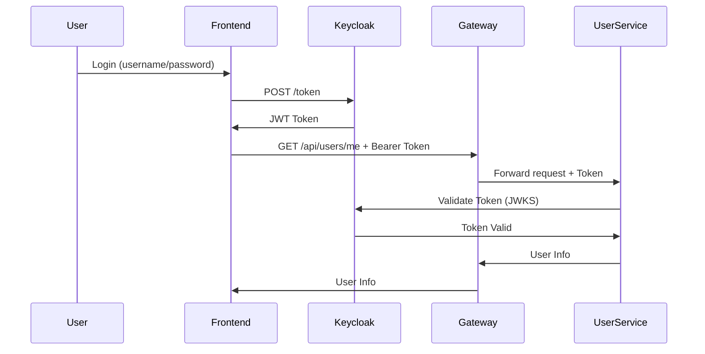

# 🔐 User Service - Microservice de Gestion des Utilisateurs

## 📋 Vue d'Ensemble

Le **User Service** est le microservice responsable de la **gestion des informations utilisateur** et de l'**authentification sécurisée** dans l'architecture BidConnect. Il agit comme un **OAuth2 Resource Server** et s'intègre avec **Keycloak** pour l'authentification.

### Caractéristiques Principales

✅ **OAuth2 Resource Server** : Validation des JWT émis par Keycloak  
✅ **Sécurité moderne** : Standards OAuth2 / OpenID Connect  
✅ **Stateless** : Pas de session serveur, scalabilité horizontale  
✅ **Intégration Eureka** : Service Discovery automatique  
✅ **Accessible via Gateway** : Point d'entrée unique sécurisé  
✅ **Docker Ready** : Déploiement containerisé

---

## 🏗️ Architecture

### Positionnement dans l'Écosystème

```
Client (Frontend Angular)
    ↓
API Gateway (Spring Cloud Gateway)
    ↓
User Service (OAuth2 Resource Server)  <----> Keycloak (Auth Server)
    ↓
Eureka Server
```

### Rôle du User Service

Le User Service **ne gère pas l'authentification directement** (login/mot de passe). Cette responsabilité est **externalisée vers Keycloak**, conformément aux bonnes pratiques modernes.

**Responsabilités** :
- ✅ Valider les JWT émis par Keycloak
- ✅ Exposer des endpoints sécurisés
- ✅ Fournir les informations de l'utilisateur authentifié
- ✅ Servir de point d'accès centralisé pour les données utilisateur

**Non-responsabilités** :
- ❌ Créer des tokens JWT
- ❌ Stocker des mots de passe
- ❌ Gérer le processus de login

---

## 🔐 Sécurité et Authentification

### Flux d'Authentification OAuth2



### Configuration OAuth2

**application.properties** :
```properties
spring.security.oauth2.resourceserver.jwt.issuer-uri=http://keycloak:8080/realms/bindconnect
```

**Docker** :
```yaml
SPRING_SECURITY_OAUTH2_RESOURCESERVER_JWT_ISSUER_URI: http://host.docker.internal:8084/realms/bindconnect
```

Cette configuration permet :
- ✅ Validation automatique des tokens
- ✅ Récupération dynamique des clés publiques (JWKS)
- ✅ Vérification de l'issuer (`iss`)
- ✅ Vérification de la signature du token

---

## 🛠️ Configuration Spring Security

### SecurityConfig

```java
@Configuration
public class SecurityConfig {
    
    @Bean
    SecurityFilterChain securityFilterChain(HttpSecurity http) throws Exception {
        http
            .csrf(csrf -> csrf.disable())
            .authorizeHttpRequests(auth -> auth
                .requestMatchers("/actuator/**").permitAll()
                .requestMatchers("/api/public/**").permitAll()
                .anyRequest().authenticated()
            )
            .oauth2ResourceServer(oauth2 -> oauth2.jwt());
        
        return http.build();
    }
}
```

### Règles de Sécurité

| Endpoint | Accès | Description |
|----------|-------|-------------|
| `/actuator/**` | Public | Endpoints de monitoring |
| `/api/public/**` | Public | Endpoints publics (futurs) |
| `/api/users/**` | Protégé | Nécessite un JWT valide |

---

## 📡 Endpoints Exposés

### GET /api/users/me

**Description** : Récupère les informations de l'utilisateur authentifié

**Authentification** : 🔐 JWT requis

**Requête** :
```bash
curl -X GET http://localhost:8083/api/users/me \
  -H "Authorization: Bearer <votre-token-jwt>"
```

**Réponse** :
```json
{
  "username": "f6bdb851-2204-4266-9511-944eeb79a780",
  "authorities": [
    { "authority": "SCOPE_email" },
    { "authority": "SCOPE_profile" }
  ]
}
```

**Codes de Réponse** :
- `200 OK` : Succès
- `401 Unauthorized` : Token manquant ou invalide
- `403 Forbidden` : Token valide mais accès refusé

---

## 🚀 Démarrage

### Prérequis

- Java 17 ou 21
- Maven 3.8+
- Docker (pour Keycloak)
- Keycloak en cours d'exécution sur le port 8084

### Démarrage Local

```bash
# 1. Démarrer Keycloak (via Docker)
docker run -d \
  -p 8084:8080 \
  -e KEYCLOAK_ADMIN=admin \
  -e KEYCLOAK_ADMIN_PASSWORD=admin \
  quay.io/keycloak/keycloak:latest start-dev

# 2. Compiler le service
cd USER-SERVICE
./mvnw clean package

# 3. Lancer le service
java -jar target/USER-SERVICE-0.0.1-SNAPSHOT.jar
```

### Démarrage avec Docker Compose

```bash
cd docker-compose/default
docker-compose up -d user-service
```

### Vérification

```bash
# Vérifier le service dans Eureka
curl http://localhost:8070/eureka/apps/USER-SERVICE

# Vérifier la santé du service
curl http://localhost:8083/actuator/health
```

---

## 🧪 Tests

### 1. Obtenir un Token depuis Keycloak

```bash
curl -X POST http://localhost:8084/realms/bindconnect/protocol/openid-connect/token \
  -H "Content-Type: application/x-www-form-urlencoded" \
  -d "client_id=bidconnect-client" \
  -d "username=testuser" \
  -d "password=testpass" \
  -d "grant_type=password"
```

**Réponse** :
```json
{
  "access_token": "eyJhbGciOiJSUzI1NiIsInR5cCI6IkpXVCJ9...",
  "expires_in": 300,
  "refresh_expires_in": 1800,
  "refresh_token": "eyJhbGciOiJIUzI1NiIsInR5cCI6IkpXVCJ9...",
  "token_type": "Bearer"
}
```

### 2. Tester l'Endpoint Sécurisé

```bash
# Avec token (doit réussir)
curl -X GET http://localhost:8083/api/users/me \
  -H "Authorization: Bearer <access_token>"

# Sans token (doit échouer avec 401)
curl -X GET http://localhost:8083/api/users/me
```

### 3. Tester via Postman

1. **Obtenir le token** :
   - Method: `POST`
   - URL: `http://localhost:8084/realms/bindconnect/protocol/openid-connect/token`
   - Body (x-www-form-urlencoded):
     - `client_id`: bidconnect-client
     - `username`: testuser
     - `password`: testpass
     - `grant_type`: password

2. **Appeler l'endpoint** :
   - Method: `GET`
   - URL: `http://localhost:8083/api/users/me`
   - Headers:
     - `Authorization`: Bearer <access_token>

---

## 🔧 Configuration

### application.properties

```properties
# Server
server.port=8083
spring.application.name=user-service

# Eureka
eureka.client.service-url.defaultZone=http://localhost:8070/eureka/
eureka.instance.prefer-ip-address=true

# OAuth2 Resource Server
spring.security.oauth2.resourceserver.jwt.issuer-uri=http://localhost:8084/realms/bindconnect

# Actuator
management.endpoints.web.exposure.include=health,info,metrics
management.endpoint.health.show-details=always
```

### Variables d'Environnement Docker

```yaml
environment:
  - SPRING_SECURITY_OAUTH2_RESOURCESERVER_JWT_ISSUER_URI=http://host.docker.internal:8084/realms/bindconnect
  - EUREKA_CLIENT_SERVICE_URL_DEFAULTZONE=http://eureka-server:8070/eureka/
```

---

## 📊 Intégration avec Eureka

Le User Service s'enregistre automatiquement dans Eureka Server.

**Avantages** :
- ✅ Découverte dynamique du service
- ✅ Load balancing automatique
- ✅ Health checks
- ✅ Communication inter-services sans adresses statiques

**Vérification** :
```bash
curl http://localhost:8070/eureka/apps/USER-SERVICE
```

---

## 🌐 Accès via API Gateway

En production, tous les appels passent par l'API Gateway :

```
http://localhost:8072/user-service/api/users/me
```

**Avantages** :
- ✅ Sécurité centralisée
- ✅ Rate limiting
- ✅ Monitoring centralisé
- ✅ Gestion des routes

---

## ✅ Fonctionnalités Implémentées

- [x] Intégration complète avec Keycloak
- [x] Validation des JWT
- [x] Endpoint sécurisé `/api/users/me`
- [x] Enregistrement dans Eureka
- [x] Fonctionnement en environnement Docker
- [x] Tests via Postman / curl
- [x] Séparation claire Auth Server / Resource Server
- [x] Configuration OAuth2 Resource Server
- [x] Spring Security configuré

---

## 🚧 Roadmap

### Fonctionnalités Prévues

- [ ] **Gestion des rôles métier** : Mapping ADMIN, OWNER, SUPPLIER
- [ ] **Endpoint de profil enrichi** : `/api/users/profile`
- [ ] **Communication inter-services** : Endpoints pour Submission/Notification Services
- [ ] **Vérification des scopes** : Contrôle d'accès fin
- [ ] **Gestion des utilisateurs** : CRUD complet
- [ ] **Synchronisation Keycloak** : Import/Export utilisateurs
- [ ] **Audit logging** : Traçabilité des accès

---

## 🎯 Choix Techniques

| Élément | Choix | Justification |
|---------|-------|---------------|
| **Auth Server** | Keycloak | Standard OAuth2/OIDC, mature, extensible |
| **Token Type** | JWT | Stateless, scalable, standard |
| **Security** | Spring Security | Intégration native Spring Boot |
| **Discovery** | Eureka | Microservices dynamiques |
| **Gateway** | Spring Cloud Gateway | Centralisation, sécurité |
| **Docker** | Oui | Reproductibilité, déploiement |

---

## 📚 Ressources

### Documentation Officielle

- [Spring Security OAuth2 Resource Server](https://docs.spring.io/spring-security/reference/servlet/oauth2/resource-server/index.html)
- [Keycloak Documentation](https://www.keycloak.org/documentation)
- [OAuth 2.0 RFC](https://datatracker.ietf.org/doc/html/rfc6749)
- [OpenID Connect](https://openid.net/connect/)

### Liens Utiles

- **Keycloak Admin Console** : http://localhost:8084 (admin / admin)
- **Eureka Dashboard** : http://localhost:8070
- **Swagger UI** : http://localhost:8083/swagger-ui.html
- **Actuator Health** : http://localhost:8083/actuator/health

---

## 🐛 Troubleshooting

### Erreur : "Invalid token"

**Cause** : Token expiré ou issuer incorrect

**Solution** :
```bash
# Vérifier l'issuer dans le token
# Décoder le JWT sur https://jwt.io
# Vérifier que l'issuer correspond à la configuration
```

### Erreur : "Unable to find valid certification path"

**Cause** : Problème de certificat SSL avec Keycloak

**Solution** :
```properties
# En développement uniquement
spring.security.oauth2.resourceserver.jwt.jwk-set-uri=http://localhost:8084/realms/bindconnect/protocol/openid-connect/certs
```

### Service non enregistré dans Eureka

**Cause** : Configuration Eureka incorrecte

**Solution** :
```bash
# Vérifier les logs
docker logs user-service

# Vérifier la configuration
curl http://localhost:8083/actuator/env
```

---

## 📞 Support

Pour toute question ou problème :
- Consulter les logs : `docker logs user-service`
- Vérifier Eureka : http://localhost:8070
- Tester la santé : http://localhost:8083/actuator/health
- Consulter Swagger : http://localhost:8083/swagger-ui.html

---

**Version** : 1.0.0  
**Dernière mise à jour** : Février 2026  
**Statut** : ✅ Opérationnel
